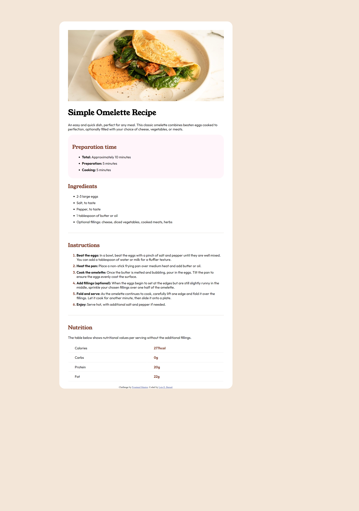

# Frontend Mentor - Recipe page solution

This is a solution to the [Recipe page challenge on Frontend Mentor](https://www.frontendmentor.io/challenges/recipe-page-KiTsR8QQKm). Frontend Mentor challenges help you improve your coding skills by building realistic projects. 

## Table of contents

- [Overview](#overview)
  - [Screenshot](#screenshot)
  - [Links](#links)
- [My process](#my-process)
  - [Built with](#built-with)
  - [What I learned](#what-i-learned)
  - [Continued development](#continued-development)
  - [Useful resources](#useful-resources)
- [Author](#author)

## Overview

### Screenshot

### Links

- Live Site URL: [https://lbernal713.github.io/Simple-Recipe-Page/]

## My process

### Built with

- Semantic HTML5 markup
- CSS custom properties
- Flexbox
- CSS Grid

### What I learned

I learned a lot of how CSS can be manipulated to generate the results that you are looking for. A lot of tinkering might be necessary to get the outcome you are looking for.

### Continued development

I plan on making slight changes in order to practice a bit more. For example I want to be able to build a background that has constant motion for aesthetic purposes in a future project and I plan to test it out using this page. I am proud that a lot of my skills I still have I will just need to refine them a bit more and that is why I plan on doing more of these challenges.

### Useful resources

I used the following sites as resources and would most likely use them in the future to assist me in project building.
- [MDN web docs](https://developer.mozilla.org/en-US/docs/Web)
- [w3schools](https://www.w3schools.com/)
- [stack overflow](https://stackoverflow.com/)

## Author

- Website - [Luis E. Bernal](https://lbernal713.github.io/lebernal_site/)
- Frontend Mentor - [@lbernal713](https://www.frontendmentor.io/profile/lbernal713)
